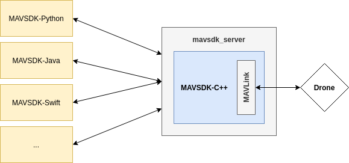

# Autogeneration

## Overview

MAVSDK is available in different languages, which all share a C++ MAVLink implementation (which is in MAVSDK-C++). `mavsdk_server` exposes the MAVSDK-C++ API over gRPC, which allows the language bindings to benefit from its MAVLink implementation.

The reason for this structure is that we don't want to maintain a MAVLink implementation for each language (therefore we share it in C++). But we also don't want to maintain the API of all the languages manually, and that is why we autogenerate most of the language bindings.

As a result, a new feature always has to be implemented in MAVSDK-C++, but can then be propagated to the language bindings through autogeneration with `protoc`.

The following parts are autogenerated:

* MAVSDK-C++ API (i.e. header files)
* Most of `mavsdk_server`
* Most of the language bindings

Those parts are maintained manually:

* MAVSDK-C++ implementation (i.e. the MAVLink business logic)
* New plugins need to be added to `mavsdk_server`, though it could be automated
* The `System` wrapper in language bindings usually needs to be updated whenever a new plugin is added, but it could be automated, too.

The root of the autogeneration system is the [MAVSDK-Proto](https://github.com/mavlink/mavsdk-proto) repository and is described in the [mechanisms](mechanisms.md) page.
